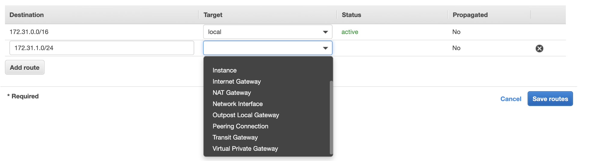

<!-- This is a template you can use for quick progress days. It removes a lot of the steps we encourage you to share in the longer template 000-DAY-ARTICLE-LONG-TEMPLATE.MD-->

# Day 2: Reach out to help cloud classmates

It's almost end of term and it hasn't been easy to do much on top of coursework. As the lab tutor I did manage to help classmates about their cloud practical questions through Piazza.

## Can I use subnets to facilitate security/configuration?

### The question:
> I think the the existence of subnets is to better organise instances to facilitate further security or other configurations targeting a certain group of instances, am I right?
  if a database server situated in a private subnet (subnet 1) and it'd doomed to only communicate with an application server in another private subnet (subnet 2), is it more advisable to associate with a route table with only a rule to route traffic to subnet 2? What do you think on this?

### My answer:
#### Part 1
1. If you want to facilitate configurations of a group of instances, I think you are more looking for an auto-scaling group. For high availability, you would want to manage groups of instances in multiple Availability Zones, which cannot be achieved by subnets.
2. If you want refined security option, Security Group is the more flexible and dominant option. If you are keen to add an (optional) extra layer of security to your database servers, AWS does allow you to put them into a stand-alone subnet and adding an NACL to reinforce the firewall rules. I would tend to think Security Group is good enough, and prefer not to add extra private subnets to my VPC for the benefit that NACL could offer.
3. I don't think you have the option to specify a routing rule to the "subnet" level. My lab sandbox is warming up and I'll confirm with you once I double-checked.

#### Part 2
So I created a new Route Table to see what options I have.
You HAVE to have a rule for your whole VPC CIDR block, and you have three options for targets: local, Instance and Network Interface. For this rule, you cannot specify a subnet as a target.

  

You can still specify a destination more specific than the above rule, and the Route Table will use this more specific rule to decide where to route the traffic. However, you still cannot specify a subnet as the target. You can choose from the options listed in the image, plus Carrier Gateway and Egress Only Internet Gateway.

  

So you can either route traffic within the whole private network, or target at a specific instance/network instance/gateway. Subnet is not an option as a routing target.

## NACL v.s. Security Group?

### The question

> I am not very sure when we should use NACL and when we should use SG?
> I see they have many features overlapping with each other, is there a best practice to select one or using them in a combination to protect our architecture?

### My answer

Hi, 
According to [AWS document on NACL](https://docs.aws.amazon.com/vpc/latest/userguide/vpc-network-acls.html):

> A network access control list (ACL) is an **optional** layer of security for your VPC that acts as a firewall for controlling traffic in and out of one or more subnets. You might set up network ACLs with rules similar to your security groups in order to add an **additional** layer of security to your VPC.

So yes, you are very right that there are overlaps between the functionalities of SG and NACL, while there are some differences, as Siddharth mentioned.

If you want to control access to your database (RDS) layer, you will:
1. (In terms of network access) Create a security group rule to allow inbound traffic from your application layer
2. (In terms of resource access) Assign an IAM role to your application layer instances to allow it to interact with your RDS resource
3. (Optional additional layer of security) set up network ACLs allowing expected traffic and denying all other traffic

Hope this helps.
Cheers,
Anran

## Internet-facing ELB v.s. Internal ELB?

### The question 
> Kinda confused about internet-facing and internal ELB. From my understanding, any ELB that has to route requests to EC2 instances from the internet has to be internet-facing, while routing requests from one tier to another is done by internal ELB. Is this correct?
> Also, in which layer does an ELB reside? While creating an ELB that is set to listen to route to private subnets, I've gotten the error message that an internet-facing ELB requires public subnets(i.e., subnets with an attached IGW). Does this mean that an internet-facing ELB should point to public subnets only in the selected AZs? What if I want to route traffic from an IGW to private servers? Is it possible to do this or can an internet-facing ELB only route to public servers (one workaround being to use NAT instances linked to private servers to which the ELB can route traffic)?

### My answer

Hi,
> From my understanding, any ELB that has to route requests to EC2 instances from the internet has to be internet-facing, while routing requests from one tier to another is done by internal ELB. Is this correct?

Yes. Internet-facing ELB resides in public subnets, has a public DNS, and can be accessed by external traffic through the Internet Gateway.

>  In which layer does an ELB reside?

ELB "connects" layers. So we can say the web ELB resides "in front of" the web layer; the app ELB resides "between" the web layer and the app layer.

> While creating an ELB that is set to listen to route to private subnets, I've gotten the error message that an internet-facing ELB requires public subnets(i.e., subnets with an attached IGW). 

You can let an Internet-facing ELB **route traffic to** target groups residing in private subnets. The Internet-facing ELB itself has to **reside in** the public subnets.

> Does this mean that an internet-facing ELB should point to public subnets only in the selected AZs? 

No, it can route traffic to private subnets too, if that is what you mean by "point to".

> What if I want to route traffic from an IGW to private servers? Is it possible to do this or can an internet-facing ELB only route to public servers (one workaround being to use NAT instances linked to private servers to which the ELB can route traffic)?

Internet-facing ELB takes care of the incoming traffic and you don't need the NAT gateway/instance to help incoming requests. But the web servers' outgoing responses do need to go out through NAT gateway/instance. 

Hope this helps. 
Cheers,
Anran

It feels good to be able to help.

