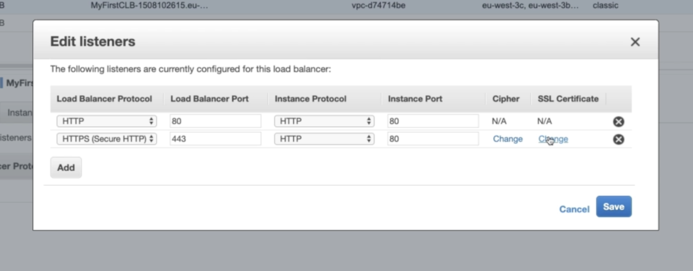

# ELB SNI support
## X.509 Certificate Management

- Clients can use SNI to specify the hostname they reach.
- Load balancers uses an X.509 certificate (SSL/TLS server certificate). 
- You can either manage X.509 certificates with ACM (aws certificate manager) or upload your own certificate.

## SNI
- Both NLB and ALB support SNI. CLB does not.
- You must specify a default certificate, and then you can add an optional list of certificates to support multiple domains.
- The client indicates the hostname of the target server in the **initial SSL handshake**
- The server will then find the correct certificate, or return the default one.

## Hands-On

### CLB
CLB only supports one SSL certificate:

### ALB & NLB
For each HTTPS listener (ALB) and TLS listener(NLB), you specify a **security policy**. Each security policy has a default certificate, and you can optionally add more certificates.

