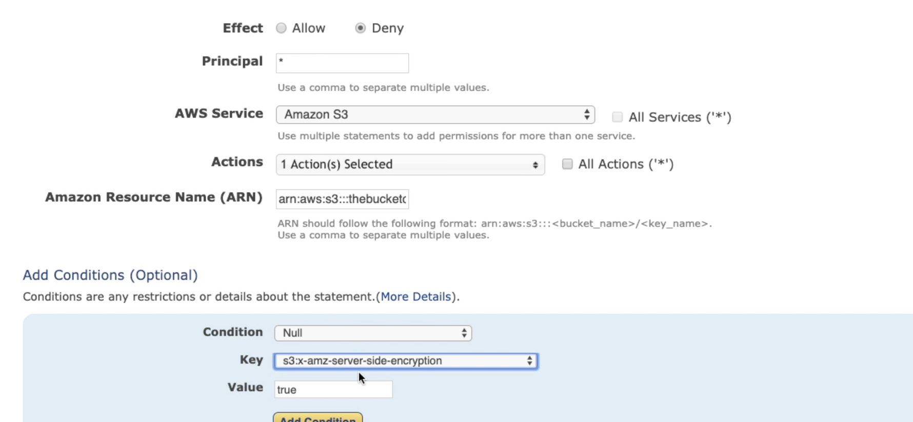
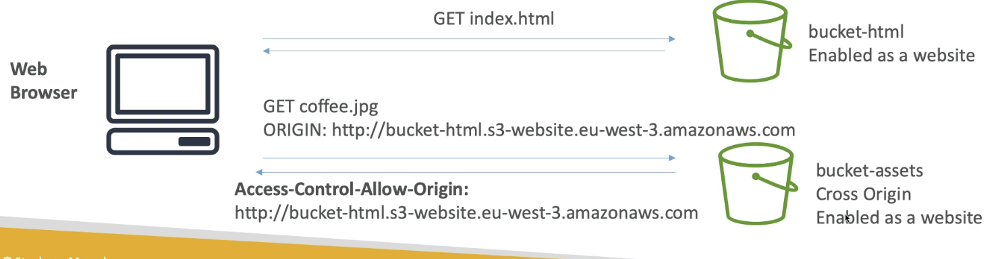
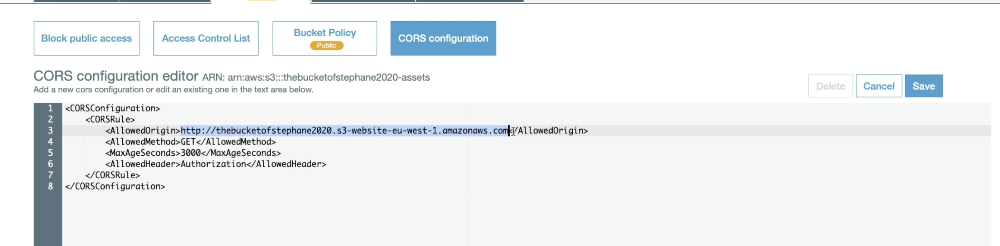

# Day 9: S3

## S3 Buckets
- defined at region level
- globally unique name
- start with lowercase letter or number
- no underscore, no uppercase

## S3 Objects

### Object key
- Objects (files) have a key
- key is composed of **prefix + object name**. 
    - e.g. `my_folder/another_folder/my_file.txt`
    - `my_folder/another_foler` is the prefix
    - `my_file.txt` is the object name
    - the whole thing is the key.
- There is no "directories" concepts within buckets, although the UI makes you think there is, but it's really **a long key that can contain slashes**.

### Object value
- object values are the content of the body.
- max object size: 5TB
- if uploading more than 5GB, **must** use multi-part upload.

### Object metadata
- Metadata: list of text key/value pairs
- Could be system or user metadata, adding information to your object.

### Object tags
- Unicode key/value pair, up to 10.
- Useful for security/lifecycle.

## Versioning
- An object can have a version ID, if versioning is enabled for its **bucket**.
- Same key overwrite will increment the "version"
- Best practice: version your buckets
- Any file that's not versioned prior to enabling versioning will have version `null`
- Suspending versioning does not delete previous versions. It just ensures no version is assigned to future versions.

# S3 Security

## Encryption at Rest
### SSE-S3
- Must set header: `"x-amz-server-side-encryption":"AES256"`
- Use HTTP/S+Header, and S3 will read in the above header and know that it should encrypt the object with the key it owns and is managing.

### SSE-KMS
- encryption using keys handled & managed by KMS
- Advantage: **user control + audit trial + rotation**
- Must set header: `"x-amz-server-side-encryption":"aws:kms"`
- Use HTTP/S + header, and s3 knows it should use the KMS Customer Master Key (CMK) to encrypt the object.

### SSE-C
- server-side encryption using keys fully manged by customer out of AWS
- *HTTPS* must be used
- encryption key must be provided in HTTPS headers, for each HTTPS request made.
- Send (Object + key) via HTTPS, Data key in header. 
- S3 receives the object and the client-provided key, and encrypts the object before storing it into the bucket.
- Not available via Console. Have to use command line interface (CLI).

### Client side encryption
- Client library, such as the Amazon S3 Encryption Client.
- The customer manages the keys and encryption cycle.
- Upload the already-encrypted object via HTTP or HTTPS.

## Encryption in transit 
Amazon S3 exposes:
- HTTP endpoint: not encrypted
- HTTPS endpoint: encryption in flight
- HTTPS is recommended. Most clients use the HTTPS endpoint by default.
- HTTPS is **mandatory for SSE-C**

## S3 access control
- User based
    - IAM policies: which API calls should be allowed for a specific user from IAM console
- Resource based
    - Bucket policies: bucket-wide policies from S3 console, allows cross-account. 
    - Object access control list: finer grain
    - Bucket access control list: less common
- An IAM principle can access an S3 object if:
    1. The user IAM permissions allows it OR the resource policy allows it
    2. AND there is no explicit DENY.
    
### S3 Bucket policies
- S3 bucket policies are JSON-based policies
    1. Resources: buckets and objects
    2. Effect: Allow or Deny
    3. Actions: set of API, e.g. `s3: GetObject`
    4. Principle: the account or user to apply the policy to.
- Use S3 bucket policy to:
    1. Grant public access to the bucket
    2. Force objects to be encrypted at upload
    3. Grant access to another account (cross account)
    

    
If there is no `"x-amz-server-side-encryption":"AES256"` header, then deny the PUT request. This reinforces that all objects uploaded will be server side encrypted.

### Bucket settings to block public access
- There are ways to block public access to buckets, to prevent company data leaks.
- There is a way to block public access on account level

## Logging and Audit
- S3 access logs can be stored in other S3 bucket
- API calls can be logged in AWS CloudTrail

## Pre-signed URLs
URLs that are valid only for a limited time.

# CORS
- Origin: an origin is a scheme (protocol), a **host** (domain) and port (https implies 443 and http implies 80, so don't have to specify port number).
- CORS means cross-origin resource sharing.
- **Web browser based** mechanism to allow requests to other origins while visiting the main origin.

## Same/different origins
- `http://example.com/app1` and `http://example.com/app2` are the same origin. Same scheme, same host(domain), same port.
- `http://www.example.com` and `http://other.example.com` are different regions: different hosts. 
- The requests won't be filled unless the request-receiving side origin allows for the requests, using CORS headers (Access-Control-Allow-Origin).

## S3 CORS
**popular exam question!**

The CORS needs to be enabled at the bucket hosting the image resources.

- The url can be `*` which allows all origins.
- This is configured at the bucket being requested for the images, and the allowed origin is where the static website is hosted.

## S3 Consistency Model
**There is no way to request "strong consistency"**.

- Read-after-write consistency: `PUT 200` -> `GET 200`
    - Except: `GET 404` -> `PUT 200` -> `GET 404`
- Eventual consistency: 
    - `PUT 200` -> `PUT 200` -> `GET 200 with older version`
    - `DELETE 200` -> `GET 200`

