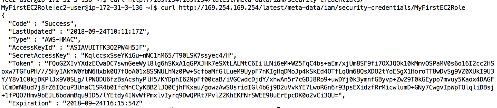

# Day 10: Programmatically access AWS

## AWS CLI
- Never put your personal credentials on an EC2. EC2 does not belong to you.
- AWS CLI on EC2 - the right way: IAM roles.

### AWS Dry Run
Some commands have `--dry-run` parameter for you to simulate the command but do not really do it.

### (popular question) AWS CLI STS Decode Errors
Error message you get from failed API calls can be decoded using the **STS Command Line**.

### CLI Profiles
`aws configure --profile <profile name>` creates/updates a profile configuration. This is how you manage multiple CLI accounts.

Use `aws s3 ls --profile <profile name>` to use the specific account to run the CLI command. If not specified, the default profile will be used.

### MFA with CLI
To use MFA with CLI, you must create a **temporary session** using the **STS GetSessionToken** API call.

The `aws sts get-session-token --serial-number <mfa device serial number> --token-code <mfa token code>` command is used to generate the temporary session token from the MFA. It gives us:
1. An `AccessKeyId`
2. A `SecretAccessKey`
3. A `SessionToken`
4. An `Expiration` time

This will be a short-living credential.

#### AWS STS
AWS Security Token Service (AWS STS) is a web service that enables you to request temporary, limited-privilege credentials for AWS Identity and Access Management (IAM) users or for users that you authenticate (federated users).

### AWS STS decode-authorization-message

[decode-authorization-message](https://docs.aws.amazon.com/cli/latest/reference/sts/decode-authorization-message.html) decodes additional information about the authorization status of a request from an encoded message returned in response to an AWS request.

Syntax:
`aws sts decode-authorization-message --encoded-message <value of the encoded message>`

## AWS EC2 Instance Metadata
URL: `http://169.254.269.254/latest/meta-data`

`169.254.269.254` is an internal Ip that works with AWS but does not work with your local computer.

- You can retrieve the IAM **role name** from the metadata, but you cannot retrieve the content of the IAM policy.

## How IAM role works with EC2

This is how EC2 role works with EC2:

For each of the role attached to the EC2, it has a short-living access credential to grant the necessary permission for the EC2.

# Credentials Provider Chain
## AWS CLI 
CLI will look for credentials in this order:
1. Command line options, `--profile` 
2. Environment variables, `AWS_ACCESS_KEY_ID` 
3. CLI credentials file `~/.aws/credentials`
4. CLI configuration file `~/.aws/config`
5. Container credentials (for ECS tasks)
6. Instance profile credentials (for EC2 instance profiles, linked with IAM roles)

## AWS Java SDK
1. Environment variables, `AWS_ACCESS_KEY_ID` 
2. Java system properties `aws.accessKeyId`
3. The default credentials profile, `~/.aws/credentials`
4. Amazon ECS container credentials
5. Instance profile credentials (for EC2 instance profiles, linked with IAM roles)

## Why is it important to know the credentials chain
1. The Instance profile (IAM role) is on the last position in the credentials chain. If you have environment variables/credential files set, that will mask your IAM role permission setting.
2. Never put your long-living credential in EC2 (e.g. env variable, credential file)! 
3. The credential should be inherited from the credentials chain. Use IAM Roles as much as possible.
4. If working outside of AWS, use environment variables/named profiles.

# AWS SDK
- CLI is using the python SDK (named boto3/botocore).
- (could be tested) For your SDK, if you do not specify a region or configure a default region, `us-east-1` will be chosen by default.

# AWS Limits and Quotas, Exponential backoff

### API Rate Limits
- `GetObject` on S3 has a limit of 5500 GET per second **per prefix**.
- `DescribeInstances` on EC2 has a limit of 100 calls per second.

- Handle throttling
    - For intermittent errors: implement **Expotential backoff**
    - For consistent errors: request an API throttling limit increase
    
### Service Quotas
- Running On-Demand standard instances: 1152 vCPU
- To increase the quota:
    1. **open a ticket**
    2. use the **Service Quotas API**  

## Exponential Backoff (for any AWS Service)
(could be tested)

If you get **ThrottlingException** intermittently, use exponential backoff.
- The retry mechanism with exponential backoff is already included in SDK API calls.
- You must implement it yourself if using the API as is or in specific cases.
- The mechanism is quite easy: whenever you retry an API call, double the waiting time.

# Signing AWS API requests
- When you call the AWS HTTP API, you sigh your request so that aws can identify you, using your AWS credentials
- If you use SDK or CLI, the HTTP requests are signed for you.
- If you are making the calls yourself, you should sign your request using Signature v4.

## HTTP header option
`Authorization: AWS4-HMAC-SHA256 Credential=<credential>,`
`SignedHeaders=content-type;host;x-amz-date,`
`Signature=<signature>`

## Query string option
A long query string appended on your URL. e.g. S3 pre-signed URLs is a GetObject request made with a SigV4 query string.

