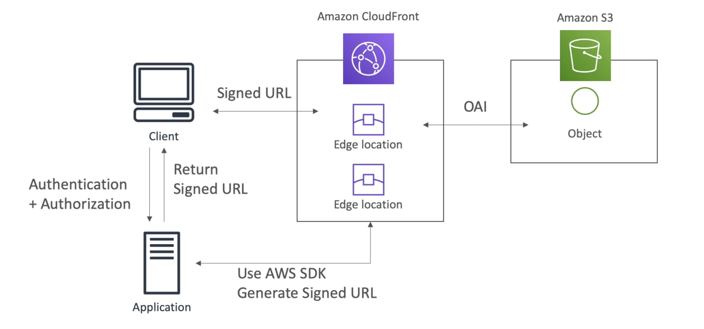

# Day 11: Cloudfront

## S3 bucket as an origin

### Enhanced security with OAI
Origin Access Identity(OAI), only allow the CloudFront to access your S3 bucket and nowhere else.

### CloudFront can be used as an ingress
Help you upload files into s3 from everywhere in the world through CloudFront.

## Custom Origin (HTTP)
- Application Load Balancer
    1. Your alb must be public
    2. SG of ALB should allow all public IP of edge locations
- EC2 instance
    1. instance must be public
    2. SG of instances should allow all public IP of edge locations
- S3 bucket
- Any HTTP backend you want. e.g. things hosted at your on-premise infrastructure

## CloudFront Geo Restriction
- white list: what countries are allowed
- or black list: what countries are not allowed

The "country" is determined using a 3rd party Geo-IP database.

## CloudFront v.s. S3 Cross Region Replication

- CloudFront is Global by nature via the edge network; S3 Cross Region Replication must be set up for each region you want it - good when you want only a few regions.
- CloudFront caches files for a TTL, good for static content or things you are ok if it is out of sync for a day or so; S3 cross region duplication updates files near real-time. S3 cross region duplication is read only. S3 is good for dynamic content.

## CloudFront and HTTPS
- Viewer Protocol Policy: ensure traffic going into cloudfront is using https:
    1. Redirect HTTP to HTTPS (suggested, avoid failure)
    2. Use HTTPS only
- Origin Protocol policy (origin can be http or s3)
    1. HTTPS only
    2. Match viewer (if client request http, send request to origin user http, and vice versa)
    
- **NOTE:** S3 bucket "websites" don't support HTTPS.

## CloudFront Signed URL/Signed Cookies
- CloudFront Signed URL are commonly used to distribute paid content through dynamic CloudFront Signed URL generation.
- Signed URL: access to one individual file
- Signed Cookies: access to multiple files

### CloudFront Signed URL v.s. S3 Pre-Signed URL

#### CloudFront Signed URL
1. CloudFront Signed URL allow access to a path, no matter the origin
2. Account wide key-pair, only the **root account** can manage the signed url key-pair.
3. Can filter by IP, path, date, expiration
4. Can leverage caching features.

#### S3 Pre-signed URL
1. Issue a request as the person who pre-signed the URL
2. Uses the IAM key of the signing IAM principle
3. Has limited lifetime

