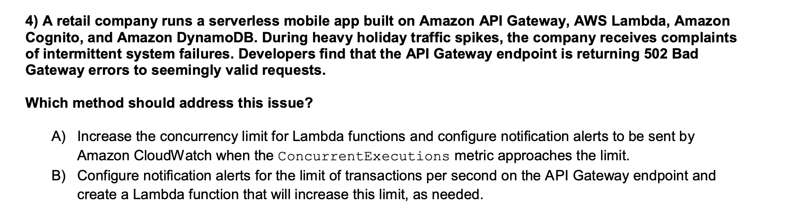
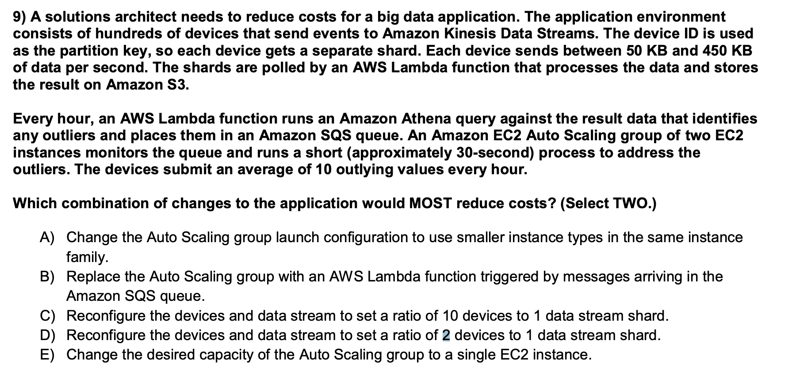
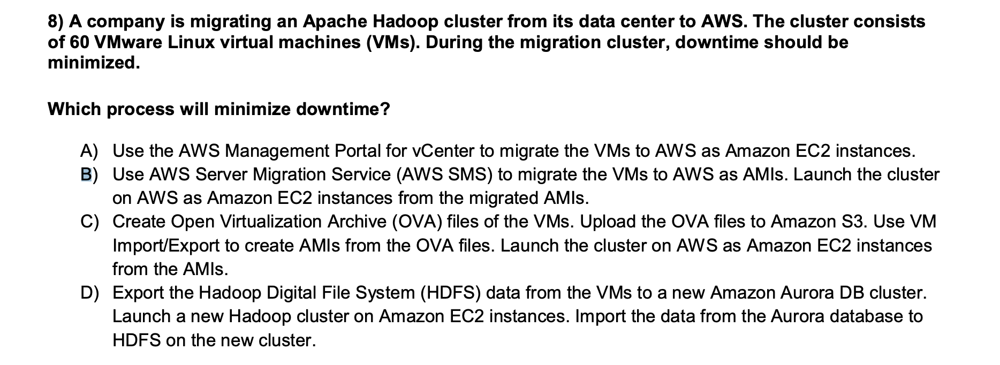

# AWS SAP example questions note

## Handling Errors in Amazon API Gateway

- `429`: Limit Exceeded Exception; Too Many Requests Exception
- The `502` internal server errors will be returned intermittently by API Gateway if the Lambda function
  exceeds concurrency limits. 
  

A) solves a 502 error, and B) solves a 429 error.

## Kinesis Data Streams Quotas and Limits
- A single shard can ingest up to 1 MB of data per second (including partition keys) or 1,000 records per second for writes. 
- Each shard can support up to five read transactions per second. Each read transaction can provide up to 10,000 records with an upper quota of 10 MB per transaction.

- With C, the amount of data would exceed the 1 MBps limit of a single shard.
- Choose B, D.

## SMS

- You can use the AWS SMS console to import your server catalog and migrate your on-premises servers to Amazon EC2.
- AWS SMS automatically replicates live server volumes to AWS and creates an Amazon Machine Image (AMI) as needed.
  
